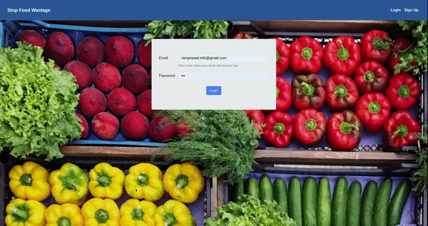
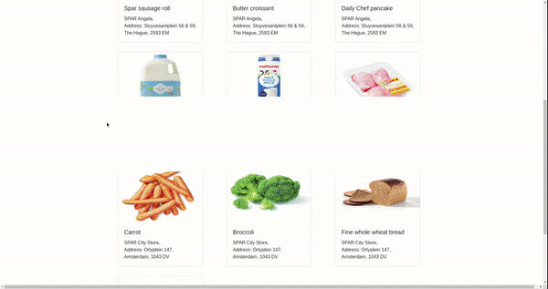
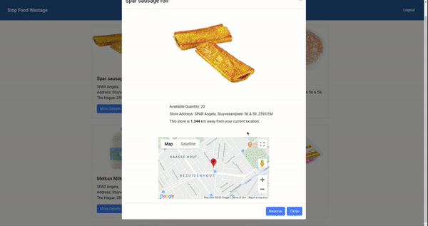
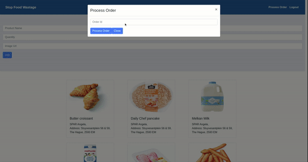

# Stop Food Wastage

## [Check out the deployed version here!](https://stop-food-wastage.herokuapp.com)

## What this project is about

This is my frontend for a full-stack application that I made, demonstrating my understanding of JavaScript and React/Redux. For more about my goals for this project, checkout **[Goals for this project](#goals-for-this-project)**

## Table of contents:

- **[Screenshots](#screenshots)**
- **[Technologies used](#technologies-used)**
- **[Goals for this project](#goals-for-this-project)**
- **[My git workflow](#my-git-workflow)**

## Screenshots

## Technologies used

#### 👀👇 Click links to view some samples in this project 👇👀

- **[React (Hooks)](./src/components/Product/ProductDetails.js)**
- **[Redux](./src/reducers/user.js)**
- **[Redux-Thunk](./src/action/user.js)**
- **[Event Stream](./src/components/Product/index.js)**
- **[Role-Based Access Control (RBAC)](./src/components/Header.js)**

## Goals for this project:

-To practice working on a bigger project
-To showcase what I have learned during my coding bootcamp at codaisseur.
-To show disciplined git usage

## My git workflow

In this project I try to use:

- Good commit messages
- Well named branches
- Pull requests with summaries

If you have feedback to improve my git usage or wants to help out in this project: **[please drop me a line!](https://www.linkedin.com/in/ramprasad-rengaramanujam)**
